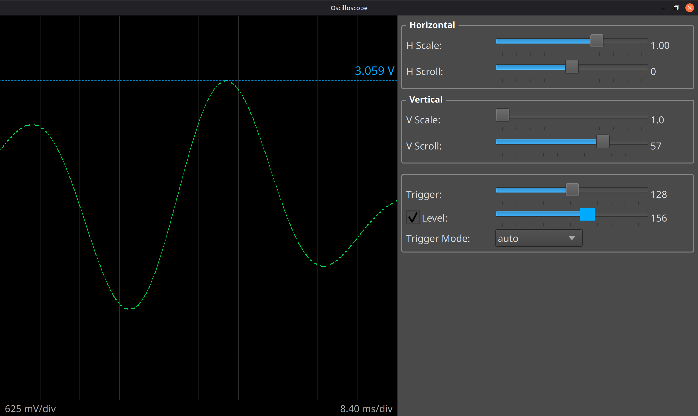

# Oscilloscope at Home

Real-time oscilloscope display for 8-bit serial ADC data. Stream raw 8-bit samples (0–255) from any serial device and visualize them instantly with edge triggering, scrolling, and zoom.

## Installation

### Requirements
- Python 3.7+
- Serial connection (else only simulation mode)

### Setup
1. Clone or download this repository
2. Install dependencies:
   ```bash
   pip install -r requirements.txt
   ```

## Usage

### With Hardware
Send 8-bit ADC samples over serial. Then run:
```bash
python slowscope.py --port /dev/ttyACM0 --sps 38461
```

### Without Hardware (Simulation)
Test with the generated test data (no hardware needed):
```bash
python slowscope.py
```

### Configuration
- `--port` — Serial port (e.g., `/dev/ttyACM0`, `COM3` on Windows). Omit for test mode.
- `--sps` — Sampling rate in samples per second (default: 38461)
- `--adc-range` — ADC full-scale voltage in volts (default: 5.0)
- `--chunk-size` — Samples per read (default: 256)

Examples:
```bash
# 10V range, custom sampling rate
python slowscope.py --port /dev/ttyACM0 --sps 115200 --adc-range 10.0

# 3.3V range, smaller chunks
python slowscope.py --port /dev/ttyACM0 --adc-range 3.3 --chunk-size 128
```


## Example: Arduino ATmega 32U4

See [`atmega32u4_adc.ino`](atmega32u4_adc.ino) for a complete Arduino sketch that samples the ADC at ~38 kHz and streams 8-bit values over USB serial.

## Gallery



## Hardware Requirements
- Any ADC with serial output (USB, UART, etc.)
- Output format: Raw bytes (8-bit samples, 0–255)
- Sampling rate: Configurable (samples per second)